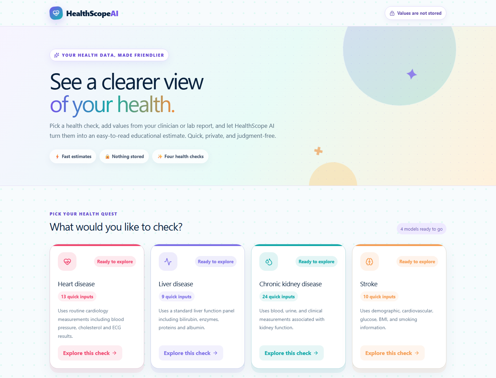
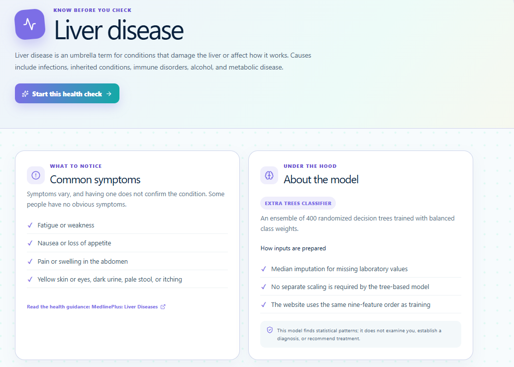
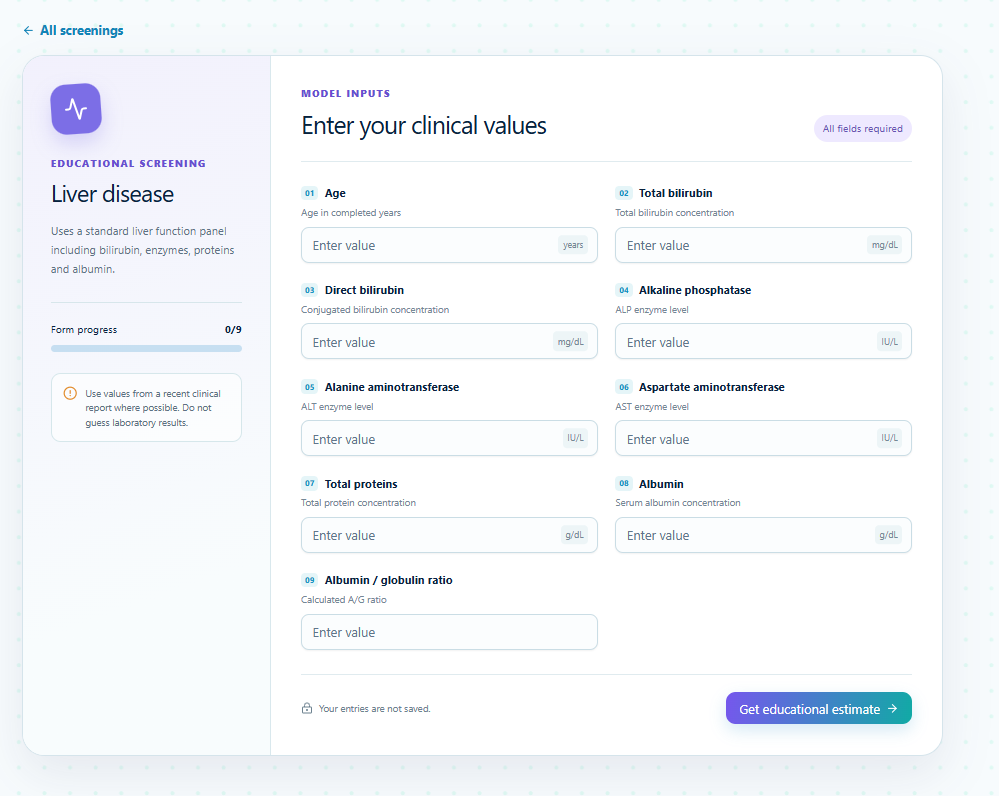
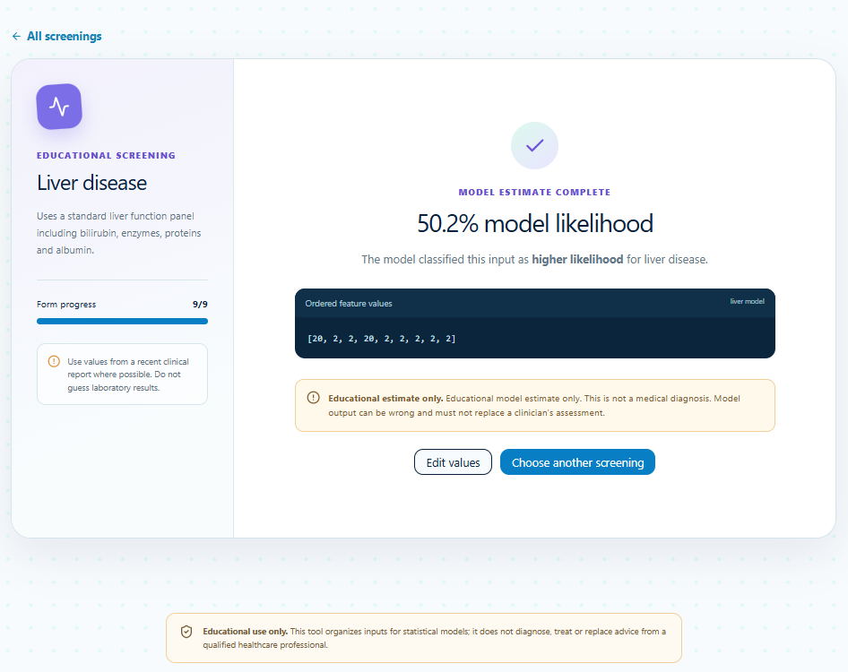

# HealthScope AI

HealthScope AI is a full-stack educational healthcare machine-learning web app.
It provides approachable disease overviews and runs four trained screening
models through a private, responsive interface.

> **Medical disclaimer:** HealthScope AI is a learning and portfolio project, not
> a medical device. Its estimates cannot diagnose, rule out, or treat disease.
> Seek qualified medical care for health concerns and emergency services for
> urgent symptoms.

## Features

- Heart, liver, chronic kidney disease, and stroke screening forms
- A dedicated overview page for each condition
- Common symptom and urgent-care guidance from public-health sources
- Exact model inputs, general reference values, and data-entry guidance
- Input validation, loading states, and readable probability results
- Four complete scikit-learn pipelines served through FastAPI
- Local development, Docker Compose, and Render deployment support
- No database, analytics, accounts, or persistence of submitted health values

## Screenshots

### Home and disease overview





### Screening and result





The screenshots use fictional demonstration values. Never commit screenshots
containing patient information.

## Technology stack

| Layer | Technologies | Purpose |
|---|---|---|
| Web interface | React 19, TypeScript, Vinext, Vite | Responsive pages, forms, and client-side API requests |
| Styling | Tailwind CSS, Radix UI primitives, custom CSS | Accessible controls and the HealthScope AI visual system |
| API | Python, FastAPI, Uvicorn, Pydantic | Model loading, input transport, and prediction endpoints |
| Machine learning | pandas, NumPy, scikit-learn | Cleaning, preprocessing, training, evaluation, and inference |
| Packaging | pickle model bundles | Stores each fitted preprocessing pipeline and classifier together |
| Deployment | Docker, Docker Compose, Render Blueprint | Reproducible local and hosted services |

The frontend and API are separate services. The browser sends a JSON object to
`POST /predict/{model_name}`; FastAPI orders its fields, runs the complete fitted
pipeline, and returns the positive-class probability plus an educational label.

## Included models

| Screening | Algorithm | Inputs | Test ROC-AUC | Artifact |
|---|---|---:|---:|---|
| Heart disease | Class-balanced logistic regression | 13 | 0.8983 | `ml/artifacts/heart_pipeline.pkl` |
| Liver disease | Class-balanced Extra Trees (400 trees) | 9 | 0.8136 | `ml/artifacts/liver_pipeline.pkl` |
| Chronic kidney disease | Class-balanced random forest (500 trees) | 24 | 1.0000* | `ml/artifacts/kidney_pipeline.pkl` |
| Stroke | Class-balanced logistic regression | 10 | 0.8436 | `ml/artifacts/stroke_pipeline.pkl` |

\*The kidney result comes from a small public dataset and should not be treated
as evidence of clinical performance. All metrics are one project split, not an
external clinical validation. Model bundles include the fitted preprocessing,
feature order, evaluation metrics, positive class, and decision threshold.

## Included datasets

All CSV files required to reproduce the current models are committed under
`ml/data/`:

| Dataset | Rows | Columns | Used by |
|---|---:|---:|---|
| `heart_disease_data.csv` | 303 | 14 | Heart model |
| `indian_liver_patient.csv` | 583 | 11 | Liver model |
| `kidney_disease.csv` | 400 | 26 | Kidney model |
| `healthcare-dataset-stroke-data.csv` | 5,110 | 12 | Stroke model |

Before redistributing or using the datasets commercially, verify their original
licenses and terms. Do not add private or identifiable health records.

## Repository structure

```text
HealthScope-AI/
├── app/                         # Pages, screening UI, and global styles
│   └── screenings/[id]/        # Disease overview route
├── backend/
│   ├── app.py                   # FastAPI prediction API
│   └── requirements.txt         # Pinned Python runtime packages
├── components/ui/               # Four UI primitives used by the app
├── lib/screening-info.ts        # Disease, model, and parameter information
├── ml/
│   ├── artifacts/               # Four ready-to-use fitted model bundles
│   ├── data/                    # Four training CSV files
│   └── training/                # Reproducible training scripts
├── public/                      # Browser assets
├── scripts/dev.mjs              # Starts the API and web app together
├── Dockerfile.api               # Production API container
├── Dockerfile.web               # Production frontend container
├── compose.yaml                 # Local two-container stack
└── render.yaml                  # Render two-service Blueprint
```

## Clone or duplicate the repository

### Clone this repository

```bash
git clone https://github.com/Shreya-Lakhera/HealthScope-AI.git
cd HealthScope-AI
```

### Create your own independent copy

Use GitHub's **Fork** button for a linked copy, or duplicate it without history:

```bash
git clone https://github.com/Shreya-Lakhera/HealthScope-AI.git my-healthscope-ai
cd my-healthscope-ai
rm -rf .git
git init
git add .
git commit -m "Initial HealthScope AI project"
```

On Windows PowerShell, replace `rm -rf .git` with:

```powershell
Remove-Item -Recurse -Force .git
```

Create an empty GitHub repository, then connect and push the copy:

```bash
git branch -M main
git remote add origin https://github.com/YOUR-USERNAME/YOUR-REPOSITORY.git
git push -u origin main
```

## Run locally

Requirements: Node.js 22.13+, Python 3.13, npm, and pip.

### 1. Create the Python environment

Windows PowerShell:

```powershell
python -m venv .venv
.\.venv\Scripts\Activate.ps1
python -m pip install --upgrade pip
pip install -r backend\requirements.txt
```

macOS or Linux:

```bash
python3 -m venv .venv
source .venv/bin/activate
python -m pip install --upgrade pip
pip install -r backend/requirements.txt
```

### 2. Install the frontend and start both services

```bash
npm ci
npm run dev
```

Open <http://localhost:5173>. The API and interactive documentation are at
<http://127.0.0.1:8000> and <http://127.0.0.1:8000/docs>.

You can also run the services separately:

```bash
npm run dev:web
python -m uvicorn backend.app:app --reload --port 8000
```

## Run with Docker

Install [Docker Desktop](https://www.docker.com/products/docker-desktop/) or a
compatible Docker Engine, then run:

```bash
docker compose up --build
```

Open <http://localhost:3000>. The containerized API is available at
<http://localhost:8000/docs>.

Stop the stack with:

```bash
docker compose down
```

Build or run either image independently if needed:

```bash
docker build -f Dockerfile.api -t healthscope-ai-api .
docker build -f Dockerfile.web --build-arg VITE_API_URL=http://localhost:8000 -t healthscope-ai-web .
docker run --rm -p 8000:8000 -e CORS_ORIGINS=http://localhost:3000 healthscope-ai-api
docker run --rm -p 3000:3000 healthscope-ai-web
```

## Retrain the models

The scripts read their matching CSV and replace the matching `.pkl` bundle:

```bash
python ml/training/train_heart.py
python ml/training/train_liver.py
python ml/training/train_kidney.py
python ml/training/train_stroke.py
```

Review the printed cross-validation and test metrics. Commit a changed artifact
only after validating it and confirming that its feature keys still match the UI.
Never load an untrusted pickle file—pickle can execute code while loading.

## Deploy on Render

1. Push this repository to GitHub.
2. Open the [Render Dashboard](https://dashboard.render.com/blueprints).
3. Select **New Blueprint Instance**.
4. Connect the GitHub repository and select HealthScope-AI.
5. Render detects `render.yaml`; review and apply both services.
6. Wait for `healthscope-ai-api` to pass `/health`, then open `healthscope-ai-web`.

The Blueprint sets `VITE_API_URL` for the web build and `CORS_ORIGINS` for the
API. If Render changes a service name because it is already taken, update those
two variables to the generated public URLs and redeploy both services.

## API routes

| Method | Route | Description |
|---|---|---|
| `GET` | `/health` | API status and loaded model names |
| `GET` | `/docs` | Interactive OpenAPI documentation |
| `POST` | `/predict/heart` | Heart model inference |
| `POST` | `/predict/liver` | Liver model inference |
| `POST` | `/predict/kidney` | Kidney model inference |
| `POST` | `/predict/stroke` | Stroke model inference |

Requests must contain exactly the feature keys documented on each disease page.
The API rejects missing and unknown fields.

## Validation

```bash
npm run lint
npm run build
python -m py_compile backend/app.py ml/training/*.py
```

The project structure and README presentation were informed by the public
[Healthcare-AI-WebApp](https://github.com/kaymen99/Healthcare-AI-WebApp), while
HealthScope AI uses its own implementation, models, interface, API, and deployment.
